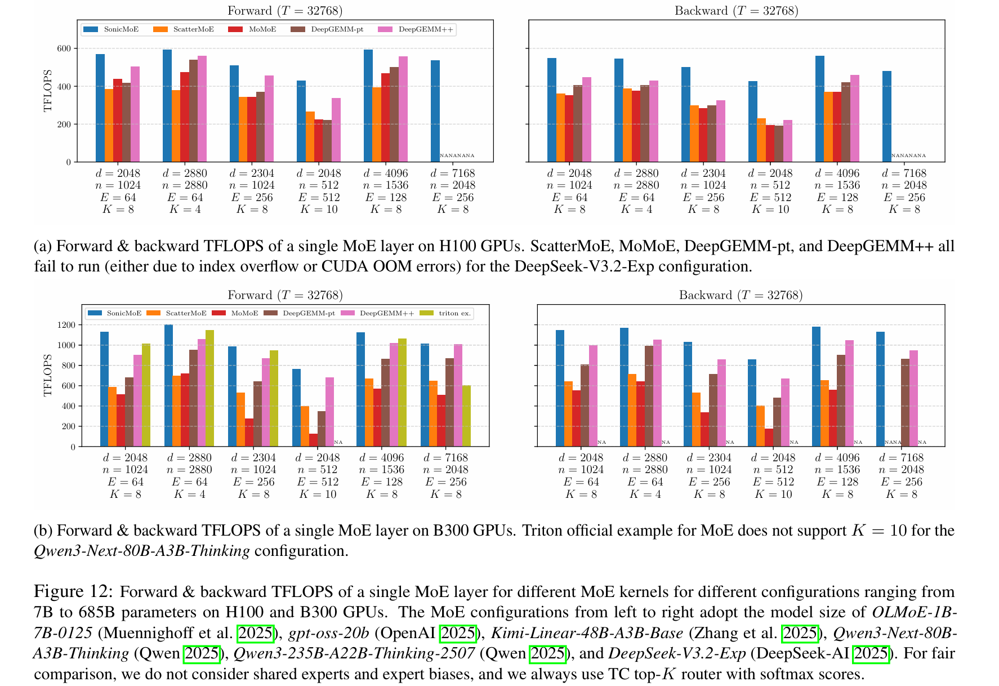

<!-- ********************************************************************************
Copyright (c) 2025, Wentao Guo, Mayank Mishra, Xinle Cheng, Ion Stoica, Tri Dao
******************************************************************************** -->

# SonicMoE: Accelerating MoE with IO and Tile-aware Optimizations
[](https://arxiv.org/abs/2512.14080) [](https://pypi.org/project/sonic-moe/)

**SonicMoE** is a simple but blazing-fast Mixture-of-Experts (MoE) implementation optimized for NVIDIA Hopper and Blackwell architecture GPUs. It mainly leverages [CuTeDSL](https://docs.nvidia.com/cutlass/media/docs/pythonDSL/cute_dsl_general/dsl_introduction.html) and [Triton](https://triton-lang.org/main/getting-started/tutorials/index.html) to deliver state-of-the-art performance through IO-aware optimizations. These 2 figures provide an overview of activation memory usage and training throughput on Hopper GPUs (H100) and Blackwell GPUs (B300). The current version of SonicMoE builds on the Grouped GEMM kernels from the [QuACK](https://github.com/Dao-AILab/quack/tree/main) library which is itself built on [CUTLASS](https://github.com/NVIDIA/cutlass).




## News

- 04/19/2026: we release SonicMoE with Blackwell (SM100) support, built on [QuACK](https://github.com/Dao-AILab/quack)'s Grouped GEMM kernels. 

## 📦 Installation

### Prerequisites

- NVIDIA Hopper GPUs (H100, H200, etc.) or Blackwell GPUs (GB200, B200, B300, etc.) 
- CUDA 12.9+ (13.0+ for B300 GPUs)
- Python 3.12+ recommended
- PyTorch 2.7+ (2.9.1 recommended)

> **B300 users:** please manually upgrade Triton to 3.6.0 after installing PyTorch.


### Install from pip
```bash
pip install sonic-moe
```

### Install from Source

```bash
# Clone the repository
git clone https://github.com/Dao-AILab/sonic-moe.git
cd sonic-moe

# Install dependencies
pip install -r requirements.txt

# Install SonicMoE
pip install -e .
```

## 🎯 Quick Start

### Basic Usage

```python
import torch
from sonicmoe import MoE, KernelBackendMoE
from sonicmoe.enums import ActivationType

# Create MoE layer
moe = MoE(
    num_experts=128,                           # Number of experts
    num_experts_per_tok=8,                     # Top-k experts per token
    hidden_size=4096,                          # Hidden dimension
    intermediate_size=1536,                    # Expert intermediate size
    activation_function=ActivationType.SWIGLU, # SwiGLU activation
    add_bias=False,                            # Add bias to linear layers
    std=0.02,                                  # Weight initialization std
).to(device="cuda", dtype=torch.bfloat16)

# Forward pass
x = torch.randn(32768, 4096, device="cuda", dtype=torch.bfloat16)
output, aux_loss = moe(x, kernel_backend_moe=KernelBackendMoE.sonicmoe)
```

## 🧪 Testing

Run the test suite to verify correctness:

```bash
make test
```

### Example usage

- SonicMoE with TC top-K routing (softmax-over-topk, or `softmax(topk(logits))`)
```bash
python benchmarks/moe-cute.py --thiek 32768,4096,1024,128,8 --activation swiglu
```

- SonicMoE with Qwen3-style routing (topk-over-softmax, or `topk(softmax(logits))`) with topk probabilities renormalization
```bash
python benchmarks/moe-cute.py --thiek 32768,4096,1024,128,8 --topk_over_softmax --norm_topk_probs
```

- SonicMoE with token rounding routing (SwiGLU activation)
```bash
python benchmarks/moe-token-rounding.py --routing nr --thiekq 16384,4096,1024,256,8,128
```

## 🤝 Contributing

We welcome contributions! Please feel free to submit issues, feature requests, or pull requests.

## 📄 License

This project is licensed under the Apache License 2.0 - see the [LICENSE](LICENSE) file for details.

## 📚 Citation

If you use SonicMoE in your research, please cite:

```bibtex
@misc{guo2025sonicmoeacceleratingmoeio,
      title={SonicMoE: Accelerating MoE with IO and Tile-aware Optimizations}, 
      author={Wentao Guo and Mayank Mishra and Xinle Cheng and Ion Stoica and Tri Dao},
      year={2025},
      eprint={2512.14080},
      archivePrefix={arXiv},
      primaryClass={cs.LG},
      url={https://arxiv.org/abs/2512.14080}, 
}
```
